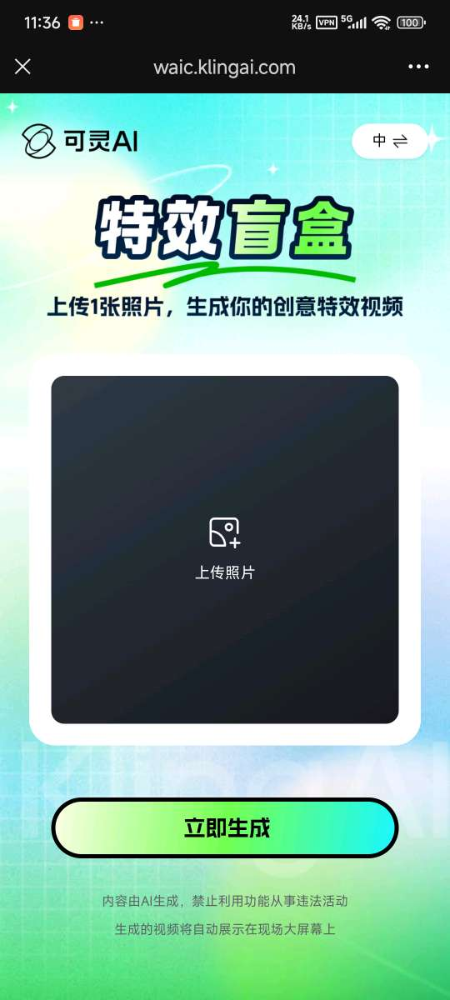
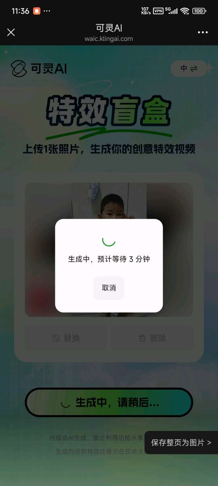
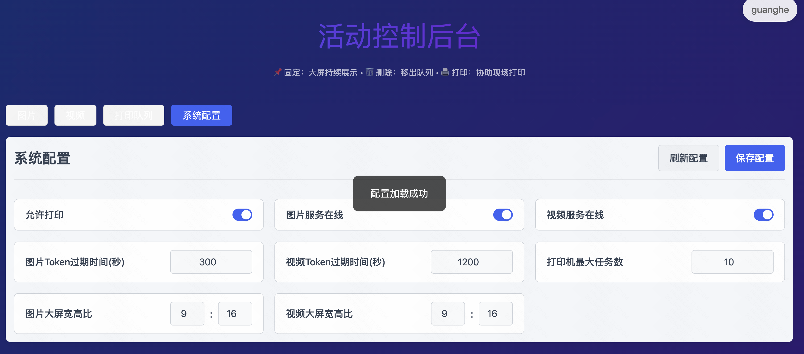
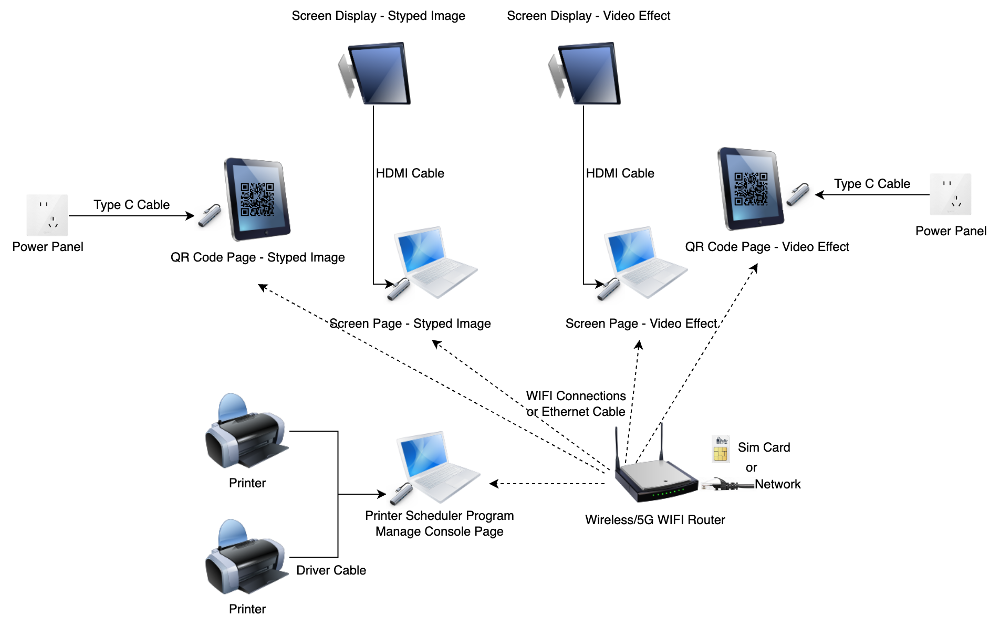
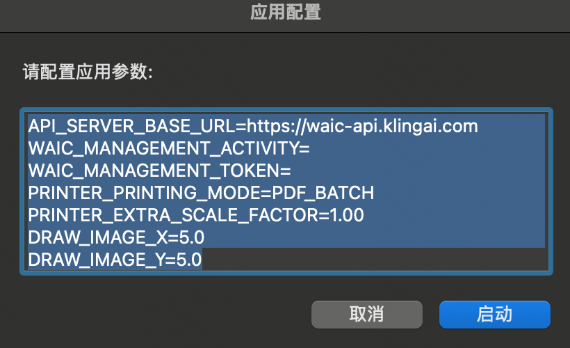

# Kling WAIC Event Equipment Setup Guide

This project was originally designed for the World Artificial Intelligence Conference (WAIC 2025) in Shanghai and has since been expanded to support multiple events (Kuaishou 2025 Creator Conference, Kuaishou Campus Recruitment).

The project is now open source, allowing anyone to build their own events based on this project. It provides comprehensive documentation for Kling WAIC event equipment, including event gameplay, management backend, pages and programs used, on-site equipment requirements, connection methods, printer configuration, and troubleshooting.

## Table of Contents

1. [Event Gameplay](#1-event-gameplay)
2. [Management Backend](#2-management-backend)
3. [Page Routes](#3-page-routes)
4. [Program Components](#4-program-components)
5. [On-site Equipment](#5-on-site-equipment)
6. [Screen Connection](#6-screen-connection)
7. [Printer Configuration](#7-printer-configuration)
8. [Troubleshooting](#8-troubleshooting)
9. [Project Setup](#9-project-setup)
10. [License](#10-license)

---

## 1. Event Gameplay

### 1.1 Restyle Collage

**Process Flow:**
1. Users scan QR code to access upload page (URL: `/qr/image`)
2. Upload portrait photo
3. Click "Generate Now", restyled 9-grid image generated in ~30 seconds
4. Users can choose to:
   - Long press to save image
   - Print image (on-site printer automatically prints, queue by number to collect)
5. Generated images are displayed on screen carousel (URL: `/screen/image`)

**Interface Screenshots:**

| QR Entry | Upload Photo | Photo Preview |
|----------|--------------|---------------|
|  |  |  |

| Generating | Generated Result | Screen Display |
|------------|------------------|----------------|
|  |  |  |

### 1.2 Effect Mystery Box

**Process Flow:**
1. Users scan QR code to access upload page (URL: `/qr/video`)
2. Upload portrait photo
3. Click "Generate Now", effect mystery box video generated in ~3 minutes
4. Users can download video file in browser
5. Generated videos are displayed on screen carousel (URL: `/screen/video`)

**Interface Screenshots:**

| QR Entry | Upload Photo | Photo Preview |
|----------|--------------|---------------|
|  |  |  |

| Generating | Generated Result | Screen Display |
|------------|------------------|----------------|
|  |  |  |

---

## 2. Management Backend

**Access URL:** `/admin`

After login, you can switch activities (enter activity name and password), includes four functional modules:

### 2.1 Image Management

- **Function:** Display all generated images, supports search by number
- **Operations:**
  - 🖨️ Print
  - 📌 Pin/Unpin (for screen group photos)
  - 🗑️ Delete (remove from screen display)


### 2.2 Video Management

- **Function:** Display all generated videos, supports search by number
- **Operations:**
  - 🗑️ Delete (remove from screen display)


### 2.3 Print Queue

- **Function:** Display pending print tasks
- **Note:** If tasks accumulate, printer may be malfunctioning


### 2.4 System Configuration

- **Function:** Modify system configuration (save to take effect)
- **Configuration Items:**
  - ✅ Allow printing
  - 🔄 Image/video service switches
  - ⏰ Token validity time
  - 📊 Printer task limit
  - 📐 Screen aspect ratio settings



**Parameter Description:**
```bash
API_SERVER_BASE_URL=                    # API service address
WAIC_MANAGEMENT_ACTIVITY=               # Activity name
WAIC_MANAGEMENT_TOKEN=                  # Activity password
PRINTER_PRINTING_MODE=PDF_BATCH         # Print mode: PDF_BATCH (batch, fast with borders) / EACH_ONE (single, slow without borders)
PRINTER_EXTRA_SCALE_FACTOR=1.00         # Print scale factor
DRAW_IMAGE_X=5.0                        # Print offset X (positive moves right after 90° rotation)
DRAW_IMAGE_Y=5.0                        # Print offset Y (positive moves up after 90° rotation)
```

> 💡 **Tip:** To eliminate border issues, try adjusting the last three parameters

---

## 3. Page Routes

| Function                       | Route | Description |
|--------------------------------|-------|-------------|
| 🔗 QR - Restyle Collage        | `/qr/image` | User QR code photo upload entry |
| 🔗 QR - Effect Mystery Box     | `/qr/video` | User QR code photo upload entry |
| 📺 Screen - Restyle Collage     | `/screen/image` | Image carousel display page |
| 📺 Screen - Effect Mystery Box | `/screen/video` | Video carousel display page |
| ⚙️ Management Backend          | `/admin` | System management interface |

## 4. Program Components

- **Printer Program**
  - 📦 Packaged MacBook application provided
  - 💻 Or run from source code (requires Java17 + Maven3)

---

## 5. On-site Equipment

### 5.1 Equipment List

| Equipment Type | Quantity | Model/Spec | Purpose                                    |
|----------------|----------|------------|--------------------------------------------|
| 🖨️ Printer | 2 units | DNP DS-620 | Photo printing                             |
| 📄 Photo Paper | Several boxes | 2 rolls + 2 ribbons per box, 400 sheets per roll | Printing supplies                          |
| 📱 iPad | 2 units | - | Display QR code entries                    |
| 📺 Large Screen | 2 units | Recommended 100 inches | Display restyle collage/effect mystery box |
| 💻 MacBook | 3 units | - | 2 for screens, 1 for printer               |
| 🪧 Promotional Banners | 2 units | - | Event promotion                            |
| 🖼️ Photo Wall | 1 unit | - | Display unclaimed photos                   |

### 5.2 Network Equipment

**Option 1: Wireless Network**
- 5G CPE + Wireless Router

**Option 2: Wired Network**
- Downstream bandwidth: 200M+
- Switch + 5 network cables

### 5.3 Accessories

- 5 Type-C adapters (supporting HDMI, Ethernet, charging, USB printer connection)

### 5.4 Equipment Connection Diagram



---

## 6. Screen Connection

### 6.1 Browser Settings

- **Recommended Browser:** Chrome
- **Display Mode:** Full-screen playback

### 6.2 Toolbar Handling

If toolbar obstruction occurs:
1. Go to "View" menu
2. Uncheck "Always Show Toolbar in Full Screen"

### 6.3 Display Configuration

- MacBook external screen requires **extended display** setup
- Adjust rotation angle: **90°** or **270°**

## 7. Printer Configuration

### 7.1 System Requirements

- **Device:** MacBook Apple Silicon
- **Driver:** DNP DP-DS620 printer driver

### 7.2 Installation Steps

1. **Download Driver**
   - [DNP DS-620 Driver Download](https://www.dnpphoto.eu/en/support-and-downloads/drivers-tools/drivers/ds620)

2. **Connect Device**
   - Connect printer to MacBook via USB
   - Open "System Preferences" → "Printers & Scanners"
   - Add printer

3. **Install Program**
   - Download and extract [Printer Program](https://github.com/KwaiVGI/kling-waic-express/releases/download/0.0.1/KlingExpressPrinter.zip)
   - Move to "Applications" folder

4. **Configure Parameters**
   - Open KlingExpressPrinter program
   - Fill in corresponding parameters to start printing



---

## 8. Troubleshooting

| Issue | Solution |
|-------|----------|
| 🔄 Error persists after paper change | Replace with different paper roll |
| 🖨️ Printer not responding | Delete and re-add printer |
| 📺 Screen playback stuttering | Use M3 Pro chip MacBook, maintain 200M+ network, use Chrome |
| 💻 Windows compatibility | Driver available, but program only tested on Mac |
| ⏸️ Print queue accumulation | Check if "Print Center" is paused, manually resume |
| 📄 Blank photo paper | Reinstall driver/check paper compatibility |
| 🚦 High concurrency queue buildup | Recommend ≤ 4-5 people submit tasks simultaneously |
| 📤 Image upload failure | Have users re-save image before uploading |
| 🔄 Image orientation error | Have users re-save image before uploading |

---

## 9. Project Setup

### 9.1 Prerequisites

1. **Register Kling Open Platform Account**
   - 🇨🇳 Domestic: https://app.klingai.com/cn/dev/document-api/quickStart/userManual
   - 🌍 International: https://app.klingai.com/global/dev/document-api/quickStart/userManual
   
2. **Get API Keys**
   - Enable API Key and top up
   - Obtain Access Key and Secret Key

### 9.2 Docker Compose Deployment (Recommended)

#### Step 1: Create Project Directory
```bash
cd ~
mkdir kling-express
cd kling-express
```

#### Step 2: Configuration Files

**Create `.env` file:**
```bash
API_SERVER_BASE_URL=https://api.yourdomain.com  # Your API service address
WAIC_OPENAPI_ACCESS_KEY=AK_MinioXXXXXX          # S3 API Access Key
WAIC_OPENAPI_SECRET_KEY=SK_MinioXXXXXX          # S3 API Secret Key
```

**Create `redis.conf` file:**
```bash
requirepass your_redis_password  # Redis password
tcp-keepalive 60
```

**Create `application-env.properties` file:**
```properties
# Redis Configuration
REDIS_HOST_WAIC=172.17.0.1
REDIS_PORT_WAIC=6379
REDIS_PASSWORD_WAIC=your_redis_password
REDIS_CLUSTER_MODE_WAIC=false
REDISSON_PROTOCOL=redis

# S3 Configuration
S3_PATH_STYLE_ENABLED=true
S3_ENDPOINT=https://minio.yourdomain.com
S3_REGION=cn-north-1
S3_ACCESS_KEY=AK_MinioXXXXXXXXX
S3_SECRET_KEY=SK_MinioXXXXXXXXX

# Kling API Configuration
KLING_OPEN_BASE_URL=https://api-beijing.klingai.com  # Domestic address

# Activity Configuration
config.activity.map[default].token=your_activity_password
config.activity.map[default].accessKey=AK_KlingAIXXXXXX
config.activity.map[default].secretKey=SK_KlingAIXXXXXX

# Multiple activity configuration example
# config.activity.map[test].token=your_activity_password
# config.activity.map[test].accessKey=AK_KlingAIYYYYYY
# config.activity.map[test].secretKey=SK_KlingAIYYYYYY
```

#### Step 3: Start Services
Place the project's `docker-compose.yml` file in the directory, then start:
```bash
docker-compose up -d
```

### 9.3 Existing Infrastructure Deployment

If you already have Redis and S3 services (e.g., AWS EC2 environment), use simplified configuration:

**docker-compose.yml:**
```yaml
services:
  web:
    image: akang943578/kling-express-web:latest
    ports:
      - "3000:80"
    environment:
      - API_SERVER_BASE_URL=${API_SERVER_BASE_URL}
    restart: always
    container_name: kling-express-web
    depends_on:
      - api

  api:
    image: akang943578/kling-express-api:latest
    ports:
      - "8738:8538"
    volumes:
      - ./application-env.properties:/app/application-env.properties
      - ./api_logs:/app/logs
    restart: always
    container_name: kling-express-api
```

**application-env.properties:**
```properties
REDIS_CLUSTER_MODE_WAIC=true
REDIS_HOST_WAIC=your_redis_host
REDIS_PORT_WAIC=6379
REDISSON_PROTOCOL=rediss

KLING_OPEN_BASE_URL=https://api-beijing.klingai.com
S3_FILE_PREFIX=  # S3 file prefix or CDN address

config.activity.map[default].token=your_activity_password
config.activity.map[default].accessKey=YDd8adFkPAEHDNQhkbTJCNKkKFfpTepN
config.activity.map[default].secretKey=SK_KlingAIXXXXXX
```

### 9.4 Security Recommendations

🔒 **HTTPS Recommended** to ensure privacy and security of user uploaded images and videos:
- Use Cloudflare free CDN and SSL services
- Or use Nginx reverse proxy + Let's Encrypt free certificates

### 9.5 Custom Configuration

Customize styles and effects by mounting custom configuration files:

```yaml
api:
  image: akang943578/kling-express-api:latest
  volumes:
    - ./style-image-prompts.txt:/app/style-image-prompts.txt      # Custom style image prompts
    - ./video-special-effects.txt:/app/video-special-effects.txt  # Custom video effects
```

> 📚 **Configuration Format:** Please refer to Kling API Open Platform documentation

### 9.6 Development Roadmap

**TODO:**
- [ ] Multi-language interface support
- [ ] Dark mode interface adaptation
- [ ] Interface theme configuration guide

---

## 10. License

```
MIT License

Copyright (c) 2024 Kuaishou Visual Generation and Interaction Center

Permission is hereby granted, free of charge, to any person obtaining a copy
of this software and associated documentation files (the "Software"), to deal
in the Software without restriction, including without limitation the rights
to use, copy, modify, merge, publish, distribute, sublicense, and/or sell
copies of the Software, and to permit persons to whom the Software is
furnished to do so, subject to the following conditions:

The above copyright notice and this permission notice shall be included in all
copies or substantial portions of the Software.

THE SOFTWARE IS PROVIDED "AS IS", WITHOUT WARRANTY OF ANY KIND, EXPRESS OR
IMPLIED, INCLUDING BUT NOT LIMITED TO THE WARRANTIES OF MERCHANTABILITY,
FITNESS FOR A PARTICULAR PURPOSE AND NONINFRINGEMENT. IN NO EVENT SHALL THE
AUTHORS OR COPYRIGHT HOLDERS BE LIABLE FOR ANY CLAIM, DAMAGES OR OTHER
LIABILITY, WHETHER IN AN ACTION OF CONTRACT, TORT OR OTHERWISE, ARISING FROM,
OUT OF OR IN CONNECTION WITH THE SOFTWARE OR THE USE OR OTHER DEALINGS IN THE
SOFTWARE.
```

---

**Third-party Component License Notice:**

- **InsightFace** code is released under the MIT License
- **InsightFace** models are for non-commercial research purposes only

> ⚠️ **Commercial Use Notice:** If you want to use the LivePortrait project for commercial purposes, you should remove and replace InsightFace's detection models to fully comply with the MIT license requirements.
