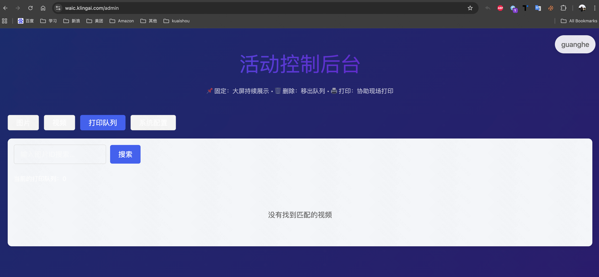

# 可灵 WAIC 活动设备使用说明

本项目最初为上海 AI 大会（WAIC 2025）设计，现已扩展支持多种活动（快手 2025 光合创作者大会、快手校园招聘活动）。

现在将项目开源，任何人都可以基于本项目搭建自己的活动。项目提供了可灵 WAIC 活动设备的完整说明，包括活动玩法、管理后台、使用到的页面和程序、现场所需设备、连接方式、打印机配置以及常见问题解答。

## 目录

1. [活动玩法](#1-活动玩法)
2. [管理后台](#2-管理后台)
3. [页面路径](#3-页面路径)
4. [程序组件](#4-程序组件)
5. [现场设备](#5-现场设备)
6. [大屏连接](#6-大屏连接)
7. [打印机配置](#7-打印机配置)
8. [常见问题](#8-常见问题)
9. [项目启动](#9-项目启动)

---

## 1. 活动玩法

### 1.1 风格转绘

**操作流程：**
1. 用户扫码进入上传页面（地址：`/qr/image`）
2. 上传人像照片
3. 点击「立即生成」，约 30 秒后生成风格化九宫格图片
4. 用户可选择：
   - 长按保存图片
   - 打印图片（现场打印机自动打印，凭编号排队领取）
5. 生成的图片会在大屏幕轮播展示（地址：`/screen/image`）

**界面截图：**

| 扫码入口 | 上传照片 | 照片预览 |
|---------|---------|---------|
|  |  |  |

| 生成中 | 生成结果 | 大屏展示 |
|-------|---------|---------|
|  |  |  |

### 1.2 特效盲盒

**操作流程：**
1. 用户扫码进入上传页面（地址：`/qr/video`）
2. 上传人像照片
3. 点击「立即生成」，约 3 分钟后生成特效盲盒视频
4. 用户可在浏览器中下载视频文件
5. 生成的视频会在大屏幕轮播展示（地址：`/screen/video`）

**界面截图：**

| 扫码入口 | 上传照片 | 照片预览 |
|---------|---------|---------|
|  |  |  |

| 生成中 | 生成结果 | 大屏展示 |
|-------|---------|---------|
|  |  |  |

---

## 2. 管理后台

**访问地址：** `/admin`

登录后可切换活动（输入活动名和密码），包含四个功能模块：

### 2.1 图片管理

- **功能：** 展示生成的所有图片，支持编号搜索
- **操作：**
  - 🖨️ 打印
  - 📌 固定/取消固定（用于大屏合影）
  - 🗑️ 删除（从大屏展示中移除）


### 2.2 视频管理

- **功能：** 展示生成的所有视频，支持编号搜索
- **操作：**
  - 🗑️ 删除（从大屏展示中移除）


### 2.3 打印队列

- **功能：** 显示待打印的任务
- **注意：** 若存在任务堆积，说明打印机可能故障



### 2.4 系统配置

- **功能：** 更改系统配置（需保存后生效）
- **配置项：**
  - ✅ 允许打印
  - 🔄 图片/视频服务开关
  - ⏰ Token 有效时间
  - 📊 打印机任务数上限
  - 📐 大屏宽高比设置


**参数说明：**
```bash
API_SERVER_BASE_URL=                    # API 服务地址
WAIC_MANAGEMENT_ACTIVITY=               # 活动名称
WAIC_MANAGEMENT_TOKEN=                  # 活动密码
PRINTER_PRINTING_MODE=PDF_BATCH         # 打印模式：PDF_BATCH（批量，快速有黑边）/ EACH_ONE（单张，慢速无黑边）
PRINTER_EXTRA_SCALE_FACTOR=1.00         # 打印缩放比例
DRAW_IMAGE_X=5.0                        # 打印偏移 X（旋转90度后正数向右）
DRAW_IMAGE_Y=5.0                        # 打印偏移 Y（旋转90度后正数向上）
```

> 💡 **提示：** 为消除黑边问题，请尝试调整后三个参数

---

## 3. 页面路径

| 功能 | 路径 | 说明 |
|------|------|------|
| 🔗 扫码 - 风格转绘 | `/qr/image` | 用户扫码上传照片入口 |
| 🔗 扫码 - 特效盲盒 | `/qr/video` | 用户扫码上传照片入口 |
| 📺 大屏 - 风格转绘 | `/screen/image` | 图片轮播展示页面 |
| 📺 大屏 - 特效盲盒 | `/screen/video` | 视频轮播展示页面 |
| ⚙️ 管理后台 | `/admin` | 系统管理界面 |

## 4. 程序组件

- **打印机打印程序**
  - 📦 提供打包好的 MacBook 应用
  - 💻 或者源码运行（需 Java17 + Maven3）

---

## 5. 现场设备

### 5.1 设备清单

| 设备类型 | 数量 | 型号/规格 | 用途 |
|---------|------|----------|------|
| 🖨️ 打印机 | 2台 | DNP DS-620 | 照片打印 |
| 📄 相纸 | 若干箱 | 每箱2卷+2色带，每卷400张 | 打印耗材 |
| 📱 iPad | 2台 | - | 展示扫码入口 |
| 📺 大屏 | 2台 | 推荐100寸 | 展示风格转绘/特效盲盒 |
| 💻 MacBook | 3台 | - | 2台接大屏，1台接打印机 |
| 🪧 宣传易拉宝 | 2个 | - | 活动宣传 |
| 🖼️ 相片墙 | 1个 | - | 展示未领取照片 |

### 5.2 网络设备

**方案一：无线网络**
- 5G CPE + 无线路由器

**方案二：有线网络**
- 下行带宽：200M+
- 交换机 + 网线 5根

### 5.3 配件

- Type-C 转接头 5个（支持 HDMI、网口、充电、USB 打印机连接）

### 5.4 设备连接图


---

## 6. 大屏连接

### 6.1 浏览器设置

- **推荐浏览器：** Chrome
- **显示模式：** 全屏播放效果页面

### 6.2 工具栏处理

如果出现工具栏遮挡问题：
1. 进入「显示」菜单
2. 取消「始终在全屏幕中显示工具栏」

### 6.3 显示器配置

- MacBook 外接大屏时需设置**扩展显示器**
- 调整旋转角度：**90°** 或 **270°**

## 7. 打印机配置

### 7.1 系统要求

- **设备：** MacBook Apple Silicon
- **驱动：** DNP DP-DS620 打印机驱动

### 7.2 安装步骤

1. **下载驱动**
   - [DNP DS-620 驱动下载](https://www.dnpphoto.eu/en/support-and-downloads/drivers-tools/drivers/ds620)

2. **连接设备**
   - 通过 USB 连接打印机到 MacBook
   - 打开「系统偏好设置」→「打印机与扫描仪」
   - 添加打印机

3. **安装程序**
   - 下载并解压 [打印程序](https://github.com/KwaiVGI/kling-waic-express/releases/download/0.0.1/KlingExpressPrinter.zip)
   - 移动到「应用程序」文件夹
   - 或者从源码启动，请自行研究

4. **配置参数**
   - 打开 KlingExpressPrinter 程序
   - 填写对应参数，开始打印


---

## 8. 常见问题

| 问题 | 解决方案 |
|------|----------|
| 🔄 换纸后仍报错 | 更换其他卷相纸 |
| 🖨️ 打印机无响应 | 删除后重新添加打印机 |
| 📺 大屏播放卡顿 | 使用 M3 Pro 芯片 MacBook，保持 200M+ 网络，使用 Chrome |
| 💻 Windows 兼容性 | 驱动可用，但程序仅在 Mac 测试过 |
| ⏸️ 打印队列堆积 | 检查「打印中心」是否暂停，手动恢复 |
| 📄 相纸空白 | 重新安装驱动/检查相纸兼容性 |
| 🚦 高并发队列堆积 | 建议同时 ≤ 4-5 人提交任务 |
| 📤 上传图片失败 | 让用户重新保存图片后再上传 |
| 🔄 图片方向错误 | 让用户重新保存图片后再上传 |

---

## 9. 项目启动

### 9.1 前置准备

1. **注册可灵开放平台账号**
   - 🇨🇳 国内：https://app.klingai.com/cn/dev/document-api/quickStart/userManual
   - 🌍 海外：https://app.klingai.com/global/dev/document-api/quickStart/userManual
   
2. **获取 API 密钥**
   - 开通 API Key 并充值
   - 获取 Access Key 和 Secret Key

### 9.2 Docker Compose 部署（推荐）

#### 步骤 1：创建项目目录
```bash
cd ~
mkdir kling-express
cd kling-express
```

#### 步骤 2：配置文件

**创建 `.env` 文件：**
```bash
API_SERVER_BASE_URL=https://api.yourdomain.com  # 你的 API 服务地址
WAIC_OPENAPI_ACCESS_KEY=AK_MinioXXXXXX          # S3 API Access Key
WAIC_OPENAPI_SECRET_KEY=SK_MinioXXXXXX          # S3 API Secret Key
```

**创建 `redis.conf` 文件：**
```bash
requirepass your_redis_password  # Redis 密码
tcp-keepalive 60
```

**创建 `application-env.properties` 文件：**
```properties
# Redis 配置
REDIS_HOST_WAIC=172.17.0.1
REDIS_PORT_WAIC=6379
REDIS_PASSWORD_WAIC=your_redis_password
REDIS_CLUSTER_MODE_WAIC=false
REDISSON_PROTOCOL=redis

# S3 配置
S3_PATH_STYLE_ENABLED=true
S3_ENDPOINT=https://minio.yourdomain.com
S3_REGION=cn-north-1
S3_ACCESS_KEY=AK_MinioXXXXXXXXX
S3_SECRET_KEY=SK_MinioXXXXXXXXX

# 可灵 API 配置
KLING_OPEN_BASE_URL=https://api-beijing.klingai.com  # 国内地址

# 活动配置
config.activity.map[default].token=your_activity_password
config.activity.map[default].accessKey=AK_KlingAIXXXXXX
config.activity.map[default].secretKey=SK_KlingAIXXXXXX

# 多活动配置示例
# config.activity.map[test].token=your_activity_password
# config.activity.map[test].accessKey=AK_KlingAIYYYYYY
# config.activity.map[test].secretKey=SK_KlingAIYYYYYY
```

#### 步骤 3：启动服务
将项目的 `docker-compose.yml` 文件放到目录下，然后启动：
* 注意 kling-express-web 和 kling-express-api 镜像都只支持arm64架构，如需在x86_64架构上运行，请自行构建镜像。
* 或者不通过 Docker Compose，直接从源码运行 web 和 api 服务，请自行研究。
```bash
docker-compose up -d
```

### 9.3 已有基础设施部署

如果你已经有 Redis 和 S3 服务（如 AWS EC2 环境），可使用简化版配置：

**docker-compose.yml：**
```yaml
services:
  web:
    image: akang943578/kling-express-web:latest
    ports:
      - "3000:80"
    environment:
      - API_SERVER_BASE_URL=${API_SERVER_BASE_URL}
    restart: always
    container_name: kling-express-web
    depends_on:
      - api

  api:
    image: akang943578/kling-express-api:latest
    ports:
      - "8738:8538"
    volumes:
      - ./application-env.properties:/app/application-env.properties
      - ./api_logs:/app/logs
    restart: always
    container_name: kling-express-api
```

**application-env.properties：**
```properties
REDIS_CLUSTER_MODE_WAIC=true
REDIS_HOST_WAIC=your_redis_host
REDIS_PORT_WAIC=6379
REDISSON_PROTOCOL=rediss

KLING_OPEN_BASE_URL=https://api-beijing.klingai.com
S3_FILE_PREFIX=  # S3 文件前缀或 CDN 地址

config.activity.map[default].token=your_activity_password
config.activity.map[default].accessKey=YDd8adFkPAEHDNQhkbTJCNKkKFfpTepN
config.activity.map[default].secretKey=SK_KlingAIXXXXXX
```

### 9.4 安全建议

🔒 **推荐启用 HTTPS** 确保用户上传图片和视频的隐私安全：
- 使用 Cloudflare 免费 CDN 和 SSL 服务
- 或使用 Nginx 反向代理 + Let's Encrypt 免费证书

### 9.5 自定义配置

可通过挂载自定义配置文件来定制风格和特效：

```yaml
api:
  image: akang943578/kling-express-api:latest
  volumes:
    - ./style-image-prompts.txt:/app/style-image-prompts.txt      # 自定义风格化图片 prompts
    - ./video-special-effects.txt:/app/video-special-effects.txt  # 自定义特效 effects
```

> 📚 **配置格式：** 请参考可灵 API 开放平台文档

### 9.6 开发计划

**TODO：**
- [ ] 界面支持多语言
- [ ] 界面适配黑暗模式  
- [ ] 提供界面主题配置说明
