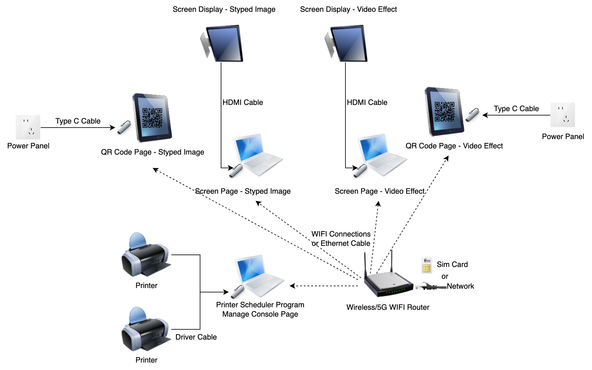

# 可灵 WAIC 活动设备使用说明

本项目最初为上海 AI 大会（WAIC 2025）设计，现已扩展支持多种活动（快手 2025 光合创作者大会、快手校园招聘活动）。

现在将项目开源，任何人都可以基于本项目搭建自己的活动。项目提供了可灵 WAIC 活动设备的完整说明，包括活动玩法、管理后台、使用到的页面和程序、现场所需设备、连接方式、打印机配置以及常见问题解答。

## 目录

1. [活动玩法](#1-活动玩法)
2. [管理后台](#2-管理后台)
3. [页面路径](#3-页面路径)
4. [程序组件](#4-程序组件)
5. [现场设备](#5-现场设备)
6. [大屏连接](#6-大屏连接)
7. [打印机配置](#7-打印机配置)
8. [常见问题](#8-常见问题)
9. [项目启动](#9-项目启动)
10. [许可证](#10-许可证)

---

## 1. 活动玩法

### 1.1 风格转绘

**操作流程：**
1. 用户扫码进入上传页面（地址：`/qr/image`）
2. 上传人像照片
3. 点击「立即生成」，约 30 秒后生成风格化九宫格图片
4. 用户可选择：
   - 长按保存图片
   - 打印图片（现场打印机自动打印，凭编号排队领取）
5. 生成的图片会在大屏幕轮播展示（地址：`/screen/image`）

**界面截图：**

| 扫码入口 | 上传照片 | 照片预览 |
|---------|---------|---------|
|  |  |  |

| 生成中 | 生成结果 | 大屏展示 |
|-------|---------|---------|
|  |  |  |

### 1.2 特效盲盒

**操作流程：**
1. 用户扫码进入上传页面（地址：`/qr/video`）
2. 上传人像照片
3. 点击「立即生成」，约 3 分钟后生成特效盲盒视频
4. 用户可在浏览器中下载视频文件
5. 生成的视频会在大屏幕轮播展示（地址：`/screen/video`）

**界面截图：**

| 扫码入口 | 上传照片 | 照片预览 |
|---------|---------|---------|
|  |  |  |

| 生成中 | 生成结果 | 大屏展示 |
|-------|---------|---------|
|  |  |  |

---

## 2. 管理后台

**访问地址：** `/admin`

登录后可切换活动（输入活动名和密码），包含四个功能模块：

### 2.1 图片管理

- **功能：** 展示生成的所有图片，支持编号搜索
- **操作：**
  - 🖨️ 打印
  - 📌 固定/取消固定（用于大屏合影）
  - 🗑️ 删除（从大屏展示中移除）


### 2.2 视频管理

- **功能：** 展示生成的所有视频，支持编号搜索
- **操作：**
  - 🗑️ 删除（从大屏展示中移除）


### 2.3 打印队列

- **功能：** 显示待打印的任务
- **注意：** 若存在任务堆积，说明打印机可能故障


### 2.4 系统配置

- **功能：** 更改系统配置（需保存后生效）
- **配置项：**
  - ✅ 允许打印
  - 🔄 图片/视频服务开关
  - ⏰ Token 有效时间
  - 📊 打印机任务数上限
  - 📐 大屏宽高比设置


**参数说明：**
```bash
API_SERVER_BASE_URL=                    # API 服务地址
WAIC_MANAGEMENT_ACTIVITY=               # 活动名称
WAIC_MANAGEMENT_TOKEN=                  # 活动密码
PRINTER_PRINTING_MODE=PDF_BATCH         # 打印模式：PDF_BATCH（批量，快速有黑边）/ EACH_ONE（单张，慢速无黑边）
PRINTER_EXTRA_SCALE_FACTOR=1.00         # 打印缩放比例
DRAW_IMAGE_X=5.0                        # 打印偏移 X（旋转90度后正数向右）
DRAW_IMAGE_Y=5.0                        # 打印偏移 Y（旋转90度后正数向上）
```

> 💡 **提示：** 为消除黑边问题，请尝试调整后三个参数

---

## 3. 页面路径

| 功能 | 路径 | 说明 |
|------|------|------|
| 🔗 扫码 - 风格转绘 | `/qr/image` | 用户扫码上传照片入口 |
| 🔗 扫码 - 特效盲盒 | `/qr/video` | 用户扫码上传照片入口 |
| 📺 大屏 - 风格转绘 | `/screen/image` | 图片轮播展示页面 |
| 📺 大屏 - 特效盲盒 | `/screen/video` | 视频轮播展示页面 |
| ⚙️ 管理后台 | `/admin` | 系统管理界面 |

## 4. 程序组件

- **打印机打印程序**
  - 📦 提供打包好的 MacBook 应用
  - 💻 或者源码运行（需 Java17 + Maven3）

---

## 5. 现场设备

### 5.1 设备清单

| 设备类型 | 数量 | 型号/规格 | 用途 |
|---------|------|----------|------|
| 🖨️ 打印机 | 2台 | DNP DS-620 | 照片打印 |
| 📄 相纸 | 若干箱 | 每箱2卷+2色带，每卷400张 | 打印耗材 |
| 📱 iPad | 2台 | - | 展示扫码入口 |
| 📺 大屏 | 2台 | 推荐100寸 | 展示风格转绘/特效盲盒 |
| 💻 MacBook | 3台 | - | 2台接大屏，1台接打印机 |
| 🪧 宣传易拉宝 | 2个 | - | 活动宣传 |
| 🖼️ 相片墙 | 1个 | - | 展示未领取照片 |

### 5.2 网络设备

**方案一：无线网络**
- 5G CPE + 无线路由器

**方案二：有线网络**
- 下行带宽：200M+
- 交换机 + 网线 5根

### 5.3 配件

- Type-C 转接头 5个（支持 HDMI、网口、充电、USB 打印机连接）

### 5.4 设备连接图



---

## 6. 大屏连接

### 6.1 浏览器设置

- **推荐浏览器：** Chrome
- **显示模式：** 全屏播放效果页面

### 6.2 工具栏处理

如果出现工具栏遮挡问题：
1. 进入「显示」菜单
2. 取消「始终在全屏幕中显示工具栏」

### 6.3 显示器配置

- MacBook 外接大屏时需设置**扩展显示器**
- 调整旋转角度：**90°** 或 **270°**

## 7. 打印机配置

### 7.1 系统要求

- **设备：** MacBook Apple Silicon
- **驱动：** DNP DP-DS620 打印机驱动

### 7.2 安装步骤

1. **下载驱动**
   - [DNP DS-620 驱动下载](https://www.dnpphoto.eu/en/support-and-downloads/drivers-tools/drivers/ds620)

2. **连接设备**
   - 通过 USB 连接打印机到 MacBook
   - 打开「系统偏好设置」→「打印机与扫描仪」
   - 添加打印机

3. **安装程序**
   - 下载并解压 [打印程序](https://github.com/KwaiVGI/kling-waic-express/releases/download/0.0.1/KlingExpressPrinter.zip)
   - 移动到「应用程序」文件夹
   - 或者从源码启动，请自行研究

4. **配置参数**
   - 打开 KlingExpressPrinter 程序
   - 填写对应参数，开始打印


---

## 8. 常见问题

| 问题 | 解决方案 |
|------|----------|
| 🔄 换纸后仍报错 | 更换其他卷相纸 |
| 🖨️ 打印机无响应 | 删除后重新添加打印机 |
| 📺 大屏播放卡顿 | 使用 M3 Pro 芯片 MacBook，保持 200M+ 网络，使用 Chrome |
| 💻 Windows 兼容性 | 驱动可用，但程序仅在 Mac 测试过 |
| ⏸️ 打印队列堆积 | 检查「打印中心」是否暂停，手动恢复 |
| 📄 相纸空白 | 重新安装驱动/检查相纸兼容性 |
| 🚦 高并发队列堆积 | 建议同时 ≤ 4-5 人提交任务 |
| 📤 上传图片失败 | 让用户重新保存图片后再上传 |
| 🔄 图片方向错误 | 让用户重新保存图片后再上传 |

---

## 9. 项目启动

### 9.1 前置准备

1. **注册可灵开放平台账号**
   - 🇨🇳 国内：https://app.klingai.com/cn/dev/document-api/quickStart/userManual
   - 🌍 海外：https://app.klingai.com/global/dev/document-api/quickStart/userManual
   
2. **获取 API 密钥**
   - 开通 API Key 并充值
   - 获取 Access Key 和 Secret Key

### 9.2 Docker Compose 部署（推荐）

#### 步骤 1：创建项目目录
```bash
cd ~
mkdir kling-express
cd kling-express
```

#### 步骤 2：配置文件

**创建 `.env` 文件：**
```bash
API_SERVER_BASE_URL=https://api.yourdomain.com  # 你的 API 服务地址
WAIC_OPENAPI_ACCESS_KEY=AK_MinioXXXXXX          # S3 API Access Key
WAIC_OPENAPI_SECRET_KEY=SK_MinioXXXXXX          # S3 API Secret Key
```

**创建 `redis.conf` 文件：**
```bash
requirepass your_redis_password  # Redis 密码
tcp-keepalive 60
```

**创建 `application-env.properties` 文件：**
```properties
# Redis 配置
REDIS_HOST_WAIC=172.17.0.1
REDIS_PORT_WAIC=6379
REDIS_PASSWORD_WAIC=your_redis_password
REDIS_CLUSTER_MODE_WAIC=false
REDISSON_PROTOCOL=redis

# S3 配置
S3_PATH_STYLE_ENABLED=true
S3_ENDPOINT=https://minio.yourdomain.com
S3_REGION=cn-north-1
S3_ACCESS_KEY=AK_MinioXXXXXXXXX
S3_SECRET_KEY=SK_MinioXXXXXXXXX

# 可灵 API 配置
KLING_OPEN_BASE_URL=https://api-beijing.klingai.com  # 国内地址

# 活动配置
config.activity.map[default].token=your_activity_password
config.activity.map[default].accessKey=AK_KlingAIXXXXXX
config.activity.map[default].secretKey=SK_KlingAIXXXXXX

# 多活动配置示例
# config.activity.map[test].token=your_activity_password
# config.activity.map[test].accessKey=AK_KlingAIYYYYYY
# config.activity.map[test].secretKey=SK_KlingAIYYYYYY
```

#### 步骤 3：启动服务
将项目的 `docker-compose.yml` 文件放到目录下，然后启动：
* 注意 kling-express-web 和 kling-express-api 镜像都只支持arm64架构，如需在x86_64架构上运行，请自行构建镜像。
* 或者不通过 Docker Compose，直接从源码运行 web 和 api 服务，请自行研究。
```bash
docker-compose up -d
```

### 9.3 已有基础设施部署

如果你已经有 Redis 和 S3 服务（如 AWS EC2 环境），可使用简化版配置：

**docker-compose.yml：**
```yaml
services:
  web:
    image: akang943578/kling-express-web:latest
    ports:
      - "3000:80"
    environment:
      - API_SERVER_BASE_URL=${API_SERVER_BASE_URL}
    restart: always
    container_name: kling-express-web
    depends_on:
      - api

  api:
    image: akang943578/kling-express-api:latest
    ports:
      - "8738:8538"
    volumes:
      - ./application-env.properties:/app/application-env.properties
      - ./api_logs:/app/logs
    restart: always
    container_name: kling-express-api
```

**application-env.properties：**
```properties
REDIS_CLUSTER_MODE_WAIC=true
REDIS_HOST_WAIC=your_redis_host
REDIS_PORT_WAIC=6379
REDISSON_PROTOCOL=rediss

KLING_OPEN_BASE_URL=https://api-beijing.klingai.com
S3_FILE_PREFIX=  # S3 文件前缀或 CDN 地址

config.activity.map[default].token=your_activity_password
config.activity.map[default].accessKey=YDd8adFkPAEHDNQhkbTJCNKkKFfpTepN
config.activity.map[default].secretKey=SK_KlingAIXXXXXX
```

### 9.4 安全建议

🔒 **推荐启用 HTTPS** 确保用户上传图片和视频的隐私安全：
- 使用 Cloudflare 免费 CDN 和 SSL 服务
- 或使用 Nginx 反向代理 + Let's Encrypt 免费证书

### 9.5 自定义配置

可通过挂载自定义配置文件来定制风格和特效：

```yaml
api:
  image: akang943578/kling-express-api:latest
  volumes:
    - ./style-image-prompts.txt:/app/style-image-prompts.txt      # 自定义风格化图片 prompts
    - ./video-special-effects.txt:/app/video-special-effects.txt  # 自定义特效 effects
```

> 📚 **配置格式：** 请参考可灵 API 开放平台文档

### 9.6 开发计划

**TODO：**
- [ ] 界面支持多语言
- [ ] 界面适配黑暗模式  
- [ ] 提供界面主题配置说明

---

## 10. 许可证

```
MIT License

Copyright (c) 2025 Kuaishou Visual Generation and Interaction Center

Permission is hereby granted, free of charge, to any person obtaining a copy
of this software and associated documentation files (the "Software"), to deal
in the Software without restriction, including without limitation the rights
to use, copy, modify, merge, publish, distribute, sublicense, and/or sell
copies of the Software, and to permit persons to whom the Software is
furnished to do so, subject to the following conditions:

The above copyright notice and this permission notice shall be included in all
copies or substantial portions of the Software.

THE SOFTWARE IS PROVIDED "AS IS", WITHOUT WARRANTY OF ANY KIND, EXPRESS OR
IMPLIED, INCLUDING BUT NOT LIMITED TO THE WARRANTIES OF MERCHANTABILITY,
FITNESS FOR A PARTICULAR PURPOSE AND NONINFRINGEMENT. IN NO EVENT SHALL THE
AUTHORS OR COPYRIGHT HOLDERS BE LIABLE FOR ANY CLAIM, DAMAGES OR OTHER
LIABILITY, WHETHER IN AN ACTION OF CONTRACT, TORT OR OTHERWISE, ARISING FROM,
OUT OF OR IN CONNECTION WITH THE SOFTWARE OR THE USE OR OTHER DEALINGS IN THE
SOFTWARE.
```
